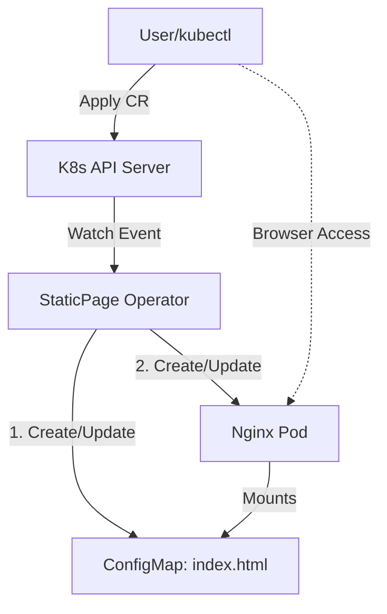
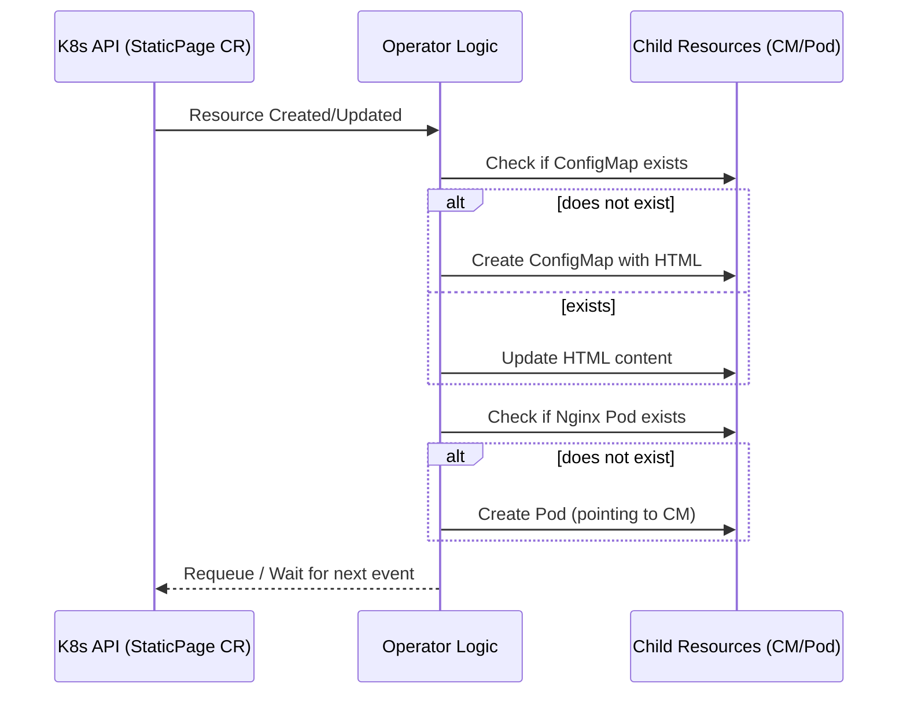

# StaticPage Operator

A Kubernetes Operator designed to automate the deployment of static HTML content using Nginx and ConfigMaps.

## Description

The **StaticPage Operator** simplifies the process of hosting simple web pages on Kubernetes. Instead of manually managing ConfigMaps and Pods, a user only needs to define a `StaticPage` Custom Resource (CR).

### Architecture Overview



The operator automatically:

* Generates a **ConfigMap** containing the HTML structure derived from your CR's `title` and `content`.
* Deploys an **Nginx Pod** that mounts the ConfigMap as a volume to serve the page.
* **Synchronizes changes**: If you update the `StaticPage` resource, the operator updates the ConfigMap, and the changes are reflected on the web page in real-time (due to Nginx serving the mounted volume).

### Reconciliation Loop



---

## Getting Started

### Prerequisites

* Go version `v1.22+` (v1.24.6+ recommended)
* Docker version `17.03+`
* Kubectl version `v1.11.3+`
* A Kubernetes cluster (Kind, Minikube, or a remote provider)

### Development (Local Run)

To test the operator logic on your local machine against a cluster:

1. **Install the Custom Resource Definitions (CRDs):**

```sh
make install
```

2. **Run the controller locally:**

```sh
make run
```

3. **Apply a sample resource (in a separate terminal):**

```sh
kubectl apply -f config/samples/web_my_example_com_v1_staticpage.yaml
```

### Deployment to the Cluster

To run the operator as a Pod within your cluster:

1. **Build and push your image:**

```sh
make docker-build docker-push IMG=<your-registry>/static-page-operator:v1
```

2. **Deploy the controller:**

```sh
make deploy IMG=<your-registry>/static-page-operator:v1
```

3. **Verify the deployment:**

```sh
kubectl get pods -n static-page-operator-system
```

## Usage

Once the operator is running, you can create a page by defining a YAML like this:

```yaml
apiVersion: web.my.example.com/v1
kind: StaticPage
metadata:
  name: example-page
spec:
  title: "Welcome!"
  content: "This page is managed by a Go Operator."
  image: "nginx:latest"
```

To view your page, use port-forwarding:

```sh
kubectl port-forward pod/example-page-pod 8080:80
```

Then visit `http://localhost:8080` in your browser.

## Project Structure

* **api/v1/**: Contains the Go type definitions for the StaticPage CRD.
* **internal/controller/**: Contains the reconciliation logic (the "brain" of the operator).
* **config/**: Contains Kustomize manifests for CRDs, RBAC, and deployment.

## Contributing

This is an educational project. Contributions, issues, and feature requests are welcome!

1. Fork the project.
2. Create your feature branch (`git checkout -b feature/amazing-feature`).
3. Commit your changes.
4. Push to the branch.
5. Open a Pull Request.

## License

Copyright 2025.
Licensed under the Apache License, Version 2.0.
